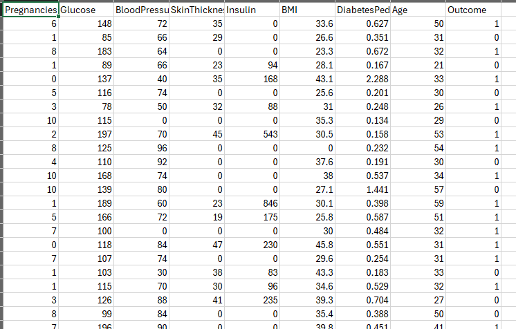
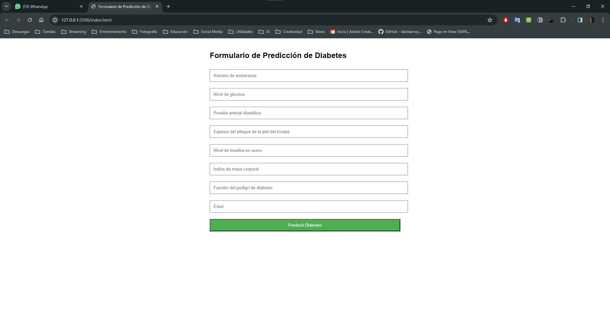

# Análisis de Diabetes en Mujeres Embarazadas

En este proyecto buscamos integrar un modelo de clasificación que permita predecir si una mujer embarazada tiene diabetes o no. Para ello, se utilizará un dataset que contiene información sobre la historia clínica de mujeres embarazadas y si estas desarrollaron diabetes o no. Este modelo se entrenará y se integrará en una aplicación web  través una API implementada en FastAPI. Esto dentro de la parte del Backend de la aplicación. En el frontend se implementará una interfaz gráfica que permita al usuario ingresar los datos necesarios para realizar la predicción y visualizar el resultado. 

## Dataset

El dataset utilizado para este proyecto es el [Pima Indians Diabetes Database](https://www.kaggle.com/uciml/pima-indians-diabetes-database) que contiene información sobre la historia clínica de mujeres de la tribu Pima y si estas desarrollaron diabetes o no. 



## Modelo de Clasificación

El modelo de clasificación que se utilizará para este proyecto  se entrenó con el dataset mencionado anteriormente y la librearía de TensorFlow. El modelo se guardó en un archivo con extensión .kera y se integrará en la aplicación web a través de una API implementada en FastAPI.

### Codigo del Modelo

```python
# Importar las librerías necesarias
import numpy as np
import pandas as pd
import tensorflow as tf
from sklearn.model_selection import train_test_split
from sklearn.preprocessing import StandardScaler

# Cargar el dataset de diabetes
df = pd.read_csv("diabetes.csv")

# Separar las variables independientes (X) y la variable dependiente (y)
X = df.iloc[:, :-1].values
y = df.iloc[:, -1].values

# Dividir el dataset en conjunto de entrenamiento y de prueba
X_train, X_test, y_train, y_test = train_test_split(X, y, test_size = 0.2, random_state = 0)

# Escalar las variables independientes
sc = StandardScaler()
X_train = sc.fit_transform(X_train)
X_test = sc.transform(X_test)

# Crear la red neuronal
ann = tf.keras.models.Sequential()
# Añadir la capa de entrada y la primera capa oculta
ann.add(tf.keras.layers.Dense(units=8, activation='relu'))
# Añadir la segunda capa oculta
ann.add(tf.keras.layers.Dense(units=8, activation='relu'))
# Añadir la capa de salida
ann.add(tf.keras.layers.Dense(units=1, activation='sigmoid'))

# Compilar la red neuronal
ann.compile(optimizer = 'adam', loss = 'binary_crossentropy', metrics = ['accuracy'])

# Entrenar la red neuronal
ann.fit(X_train, y_train, batch_size = 32, epochs = 100)

#Exportar el modelo en formato .keras
ann.save("model.keras")
```

## API

La API se implementó en FastAPI y se encargará de recibir los datos necesarios para realizar la predicción y devolver el resultado. Por el momento la API solo tiene la estructura básica y se implementará la funcionalidad de la aplicación a futuro.

### Codigo de la API

```python
from fastapi import FastAPI
import numpy as np
import pandas as pd
import tensorflow as tf
from pydantic import BaseModel
from sklearn.model_selection import train_test_split
from sklearn.preprocessing import StandardScaler

# Definición del modelo de datos para las entradas del usuario
class DatosSalud(BaseModel):
    embarazos: int
    glucosa: float
    presion_arterial: float
    espesor_triceps: float
    insulina: float
    bmi: float
    diabetes_pedigree_function: float
    edad: int

app = FastAPI()

# Cargar y preparar el modelo (asumiendo que ya está entrenado y guardado)
# En este caso, deberá ajustar la carga según cómo guarde su modelo
modelo = tf.keras.models.load_model('model.keras')

# Este ejemplo asume que ya tiene un `scaler` guardado que puede cargar
# Para este ejemplo, simplemente reutilizaremos el `sc` definido anteriormente
# En un caso real, lo cargaría desde un archivo
sc = StandardScaler()  # Debe cargar su propio scaler aquí

@app.post('/predict/')
def predict(diabetes_data: DatosSalud):
    data = np.array([[diabetes_data.embarazos, diabetes_data.glucosa, diabetes_data.presion_arterial,
                    diabetes_data.espesor_triceps, diabetes_data.insulina, diabetes_data.bmi,
                    diabetes_data.diabetes_pedigree_function, diabetes_data.edad]])
    data = sc.transform(data)  # Asegúrese de escalar los datos como lo hizo durante el entrenamiento
    prediction = modelo.predict(data)
    probabilidad = prediction[0][0]
    return {"probabilidad": probabilidad}

# En este punto, necesitará tener su modelo y scaler ya entrenados y guardados.
# Luego, deberá cargarlos en este script para hacer las predicciones.
```

## Frontend

El frontend de la aplicación se implementará con React y permitirá al usuario ingresar los datos necesarios para realizar la predicción y visualizar el resultado. Por el momento solo tenemos el diseño de la interfaz gráfica. A futuro se implementará la funcionalidad de la aplicación junto con la integración de la API.

### Diseño de la Interfaz Gráfica

