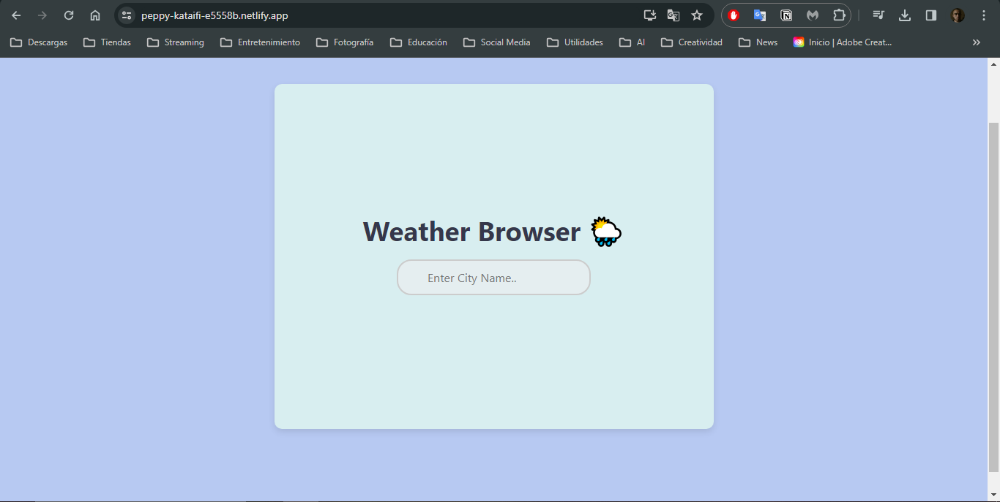
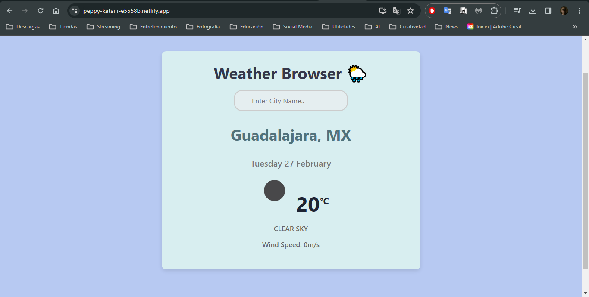
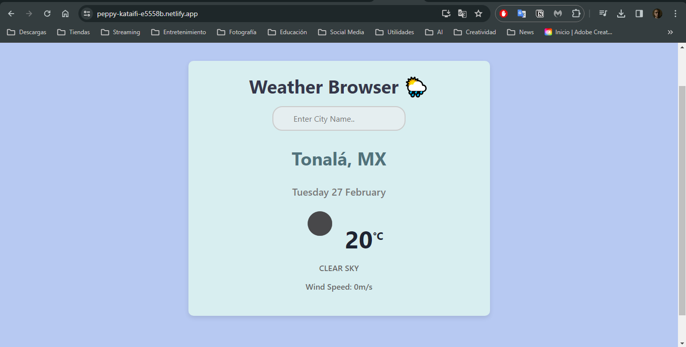
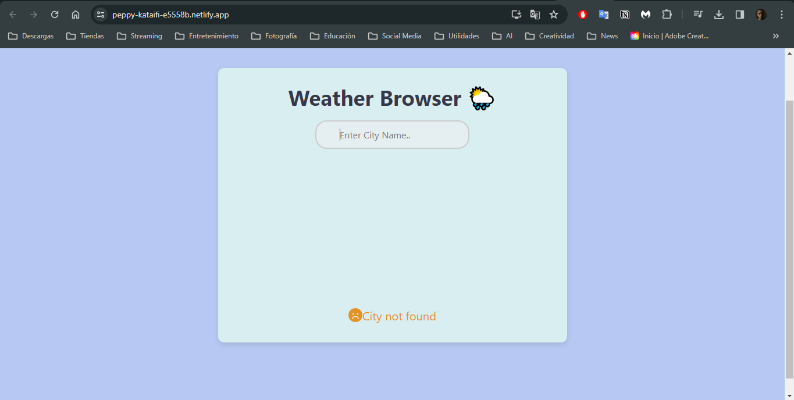

# Weather Browser

Mi aplicación Weather Browser es una aplicación web desarrollada con React que permite a los usuarios buscar y visualizar el clima actual de cualquier ciudad. Utiliza la API de OpenWeatherMap para recuperar datos climáticos, incluyendo temperatura, descripción del clima, velocidad del viento, entre otros.

## Características

- **Búsqueda de ciudades**: Los usuarios pueden buscar el clima de cualquier ciudad introduciendo el nombre de la ciudad en la barra de búsqueda y presionando la tecla Enter.
- **Visualización del clima**: Muestra información detallada del clima, como la temperatura actual, descripción del clima, velocidad del viento, y más.
- **Indicadores de carga y error**: Muestra un spinner de carga mientras se recuperan los datos y un mensaje de error en caso de que no se encuentre la ciudad o haya un problema con la API.

## Tecnologías Utilizadas

- **React.js**: Framework utilizado para construir la interfaz de usuario.
- **Axios**: Biblioteca utilizada para realizar solicitudes HTTP a la API de OpenWeatherMap.
- **FontAwesome**: Utilizado para añadir iconos estilizados a la aplicación.
- **react-loader-spinner**: Proporciona un indicador de carga visual durante la recuperación de los datos.
  
## Uso

1. **Inicio de la aplicación**: Al abrir la aplicación, te encontrarás con una barra de búsqueda.
2. **Búsqueda del clima**: Escribe el nombre de una ciudad en la barra de búsqueda y presiona Enter para obtener los datos climáticos.
3. **Visualización de resultados**: La información del clima se mostrará debajo de la barra de búsqueda, incluyendo la temperatura, descripción del clima y velocidad del viento.

## Capturas de Pantalla

