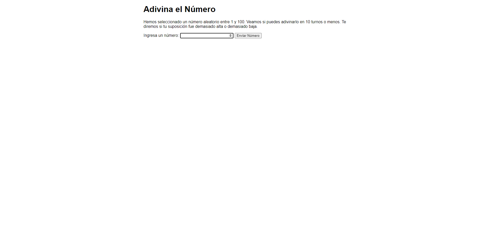
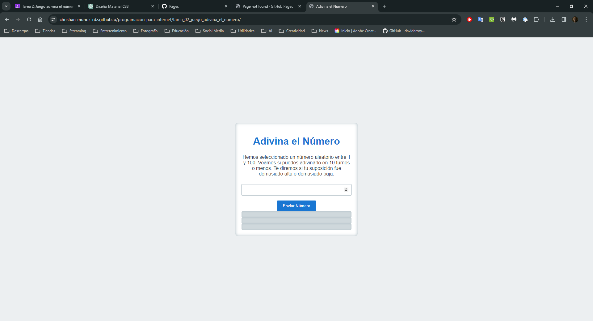

# Juego: Adivina el número

El propósito de esta práctica es conocer los fundamentos básicos de JavaScript y su interacción con HTML. La verdad es una actividad muy sencilla, pero contiene lo suficiente para conocer sobre variables, funciones, condicionales, ciclos, eventos, objetos, etc. Es por ello que sólo haré una breve descripción del funcionamiento del juego y de los elementos que lo componen.

## Descripción del juego

El juego consiste en adivinar un número aleatorio entre 1 y 100. Para ello, el jugador tiene 10 intentos. En cada intento, el jugador debe ingresar un número y el sistema le indicará si el número ingresado es mayor o menor al número a adivinar. Si el jugador adivina el número, el sistema le indicará que ha ganado y el juego termina. Si el jugador no adivina el número en los 10 intentos, el sistema le indicará que ha perdido y el juego termina. En ambos casos nos permite crear un nuevo juego.

## Lógica del juego

1. **Inicialización de Variables:**
   - Se genera un número aleatorio entre 1 y 100.
   - Se seleccionan elementos del DOM para manipularlos más adelante (intentos, resultados y mensajes).
   - Se inicializa el contador de intentos.
   - Definimos un boton para reiniciar el juego.
```javascript
let randomNumber = Math.floor(Math.random() * 100) + 1;

const guesses = document.querySelector(".guesses");
const lastResult = document.querySelector(".lastResult");
const lowOrHi = document.querySelector(".lowOrHi");

const guessSubmit = document.querySelector(".guessSubmit");
const guessField = document.querySelector(".guessField");

let guessCount = 1;
let resetButton;
guessField.focus();
```

2. **Función `checkGuess`:**
   - Se activa al hacer clic en el botón "Enviar Número".
   - Verifica si el número ingresado por el usuario coincide con el número aleatorio.
   - Actualiza la interfaz con mensajes apropiados y cambia el color de fondo del mensaje de resultado.
   - Lleva la cuenta de los intentos y finaliza el juego después de 10 intentos o si el usuario adivina el número.

```javascript
function checkGuess() {
    let userGuess = Number(guessField.value);
    if (guessCount === 1) {
        guesses.textContent = "Intentos anteriores: ";
    }
    guesses.textContent += userGuess + " ";

    if (userGuess === randomNumber) {
        lastResult.textContent = "¡Felicidades! ¡Lo adivinaste!";
        lastResult.style.backgroundColor = "green";
        lowOrHi.textContent = "";
        setGameOver();
    } else if (guessCount === 10) {
        lastResult.textContent = "¡¡¡Fin del juego!!!";
        setGameOver();
    } else {
        lastResult.textContent = "¡Incorrecto!";
        lastResult.style.backgroundColor = "red";
        if (userGuess < randomNumber) {
        lowOrHi.textContent = "¡El número es muy bajo!";
        } else if (userGuess > randomNumber) {
        lowOrHi.textContent = "¡El número es muy grande!";
        }
    }

    guessCount++;
    guessField.value = "";
    guessField.focus();
}

guessSubmit.addEventListener("click", checkGuess);
```

3. **Finalización y Reinicio del Juego:**
   - `setGameOver`: Deshabilita los campos de entrada y agrega un botón para comenzar un nuevo juego.
   - `resetGame`: Restablece el juego a su estado inicial, limpiando mensajes y contadores.

```javascript
function setGameOver() {
    guessField.disabled = true;
    guessSubmit.disabled = true;
    resetButton = document.createElement("button");
    resetButton.textContent = "Iniciar nuevo juego";
    document.body.append(resetButton);
    resetButton.addEventListener("click", resetGame);
}

function resetGame() {
    guessCount = 1;

    const resetParas = document.querySelectorAll(".resultParas p");
    for (let i = 0; i < resetParas.length; i++) {
        resetParas[i].textContent = "";
    }

    resetButton.parentNode.removeChild(resetButton);

    guessField.disabled = false;
    guessSubmit.disabled = false;
    guessField.value = "";
    guessField.focus();

    lastResult.style.backgroundColor = "white";

    randomNumber = Math.floor(Math.random() * 100) + 1;
}
```

## Resultado final

Este es el resultado original del juego:



La verdad no me agradó mucho el diseño, así que decidí hacerle algunos cambios. El resultado final es el siguiente:




