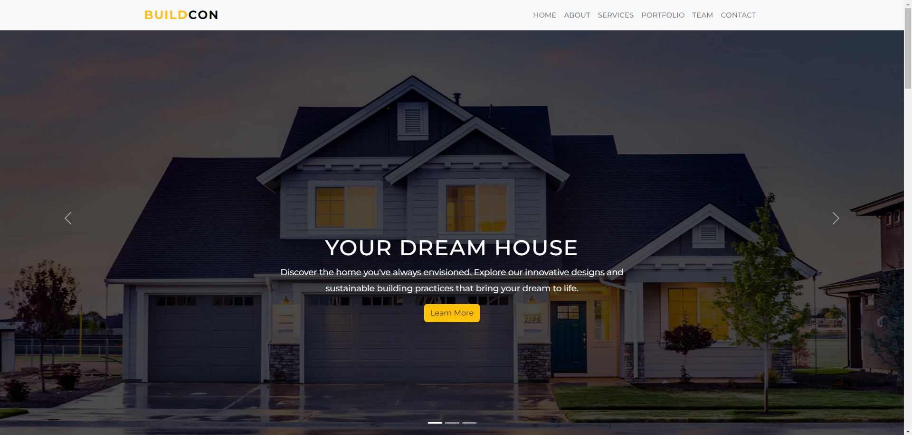
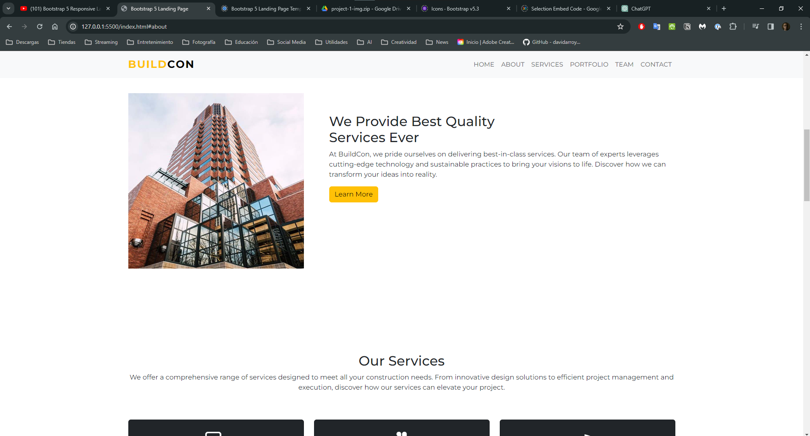
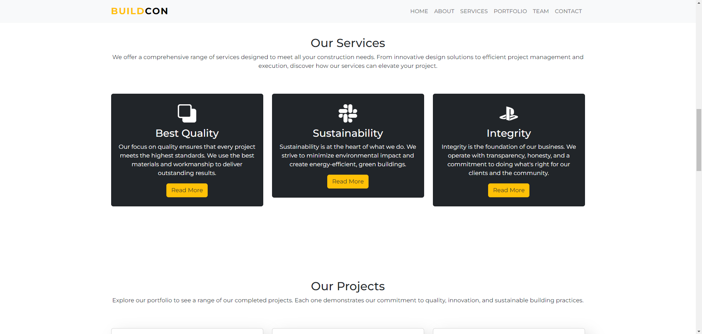
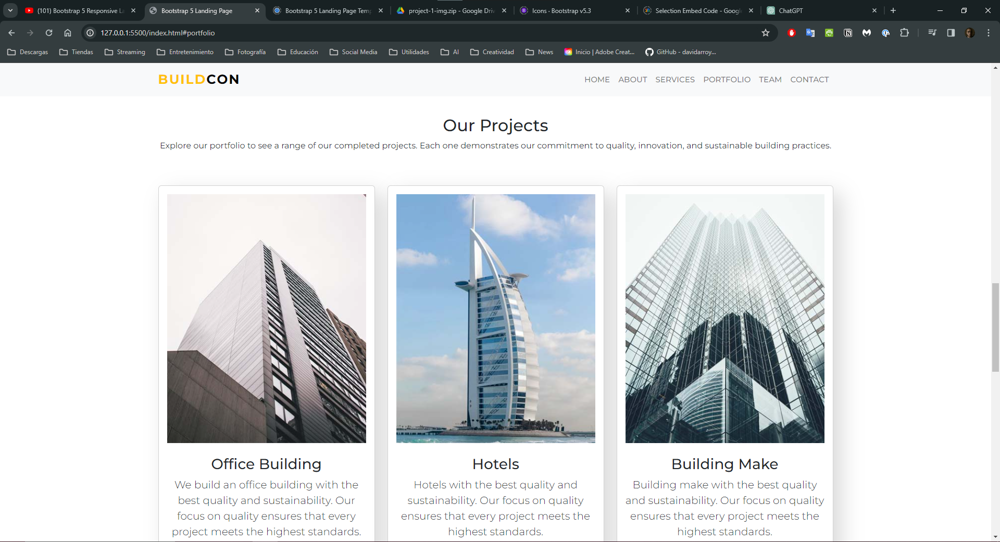
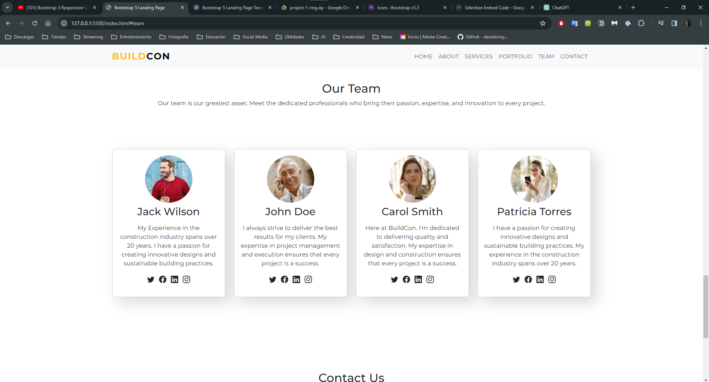
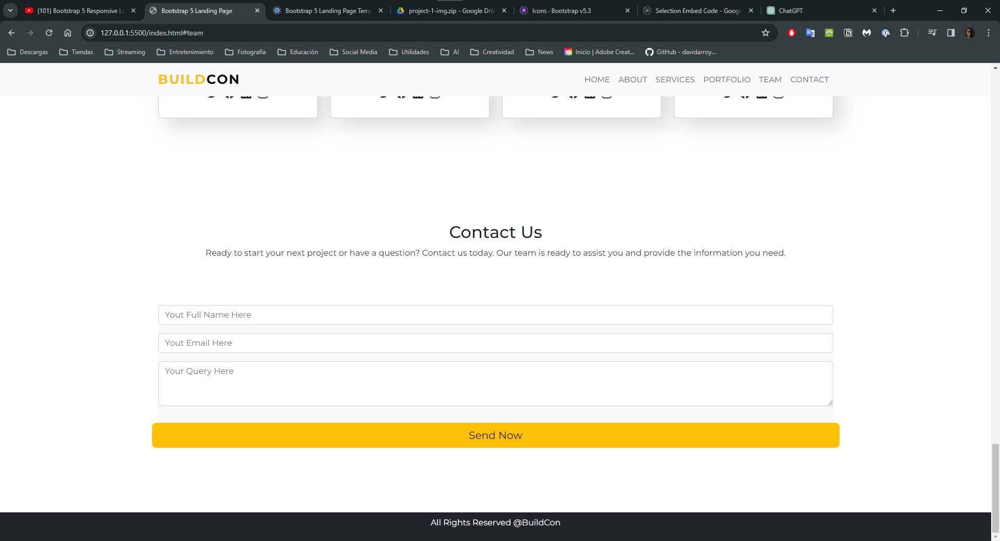
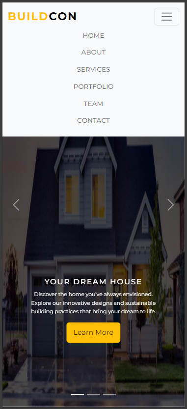
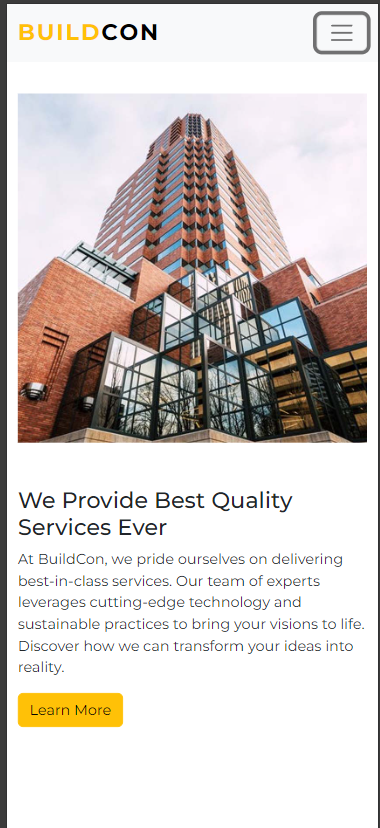
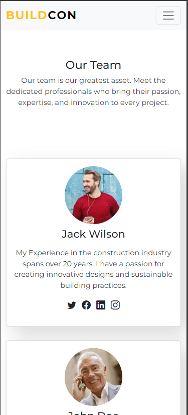

# Landing Page de Constructora

En esta practica desarrollé una landing page para una constructora para aprender a manejar el framework de CSS Bootstrap, el cual nos permite crear páginas web responsive de manera sencilla, sin tener que escribir mucho código. Además, nos permite añadirle estilos personalizados  muy bonitos sin tener que pensar mucho en el diseño.

He de decir que la experiencia de manejar Bootstrap fue muy buena, ya que me permitió crear una página web responsive en menos tiempo del que me hubiera tomado si hubiera tenido que escribir todo el código CSS desde cero. Todo se maneja a través de clases y componentes que ya vienen predefinidos, lo que hace que el desarrollo sea mucho más rápido.

## Capturas de pantalla

### Así se ve la página en una computadora de escritorio:

Bootstrap me permitió añadir una barrade navegación interactiva y un carrusel de imágenes de manera muy sencilla y sin tener que programar código JavaScript. Todos estos elementos vienen en su página web y solo tuve que copiar y pegar el código.

### Así se ve la página en un dispositivo móvil:

  
 
Como se puede ver, la página se adapta muy bien a dispositivos móviles, además la barra de navegación se convierte en un menú desplegable que se puede abrir y cerrar con un botón.