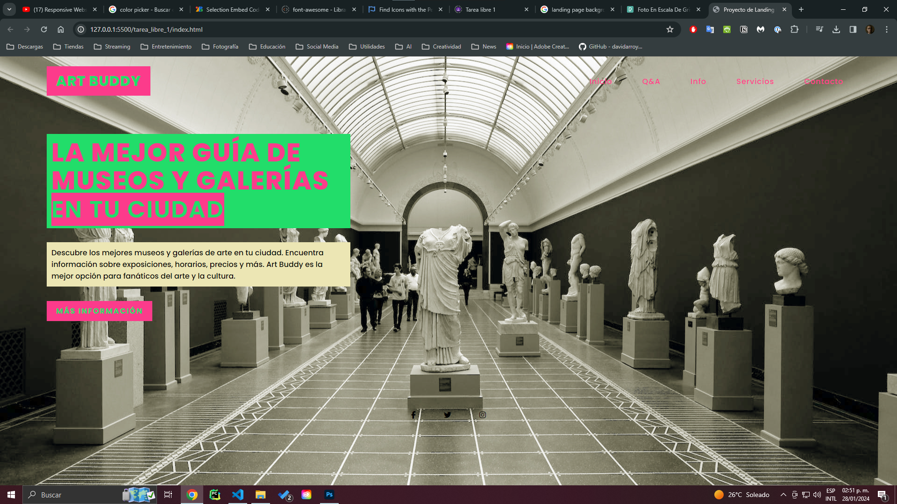
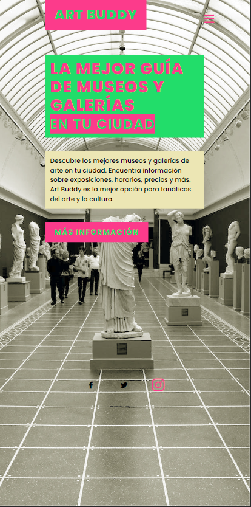
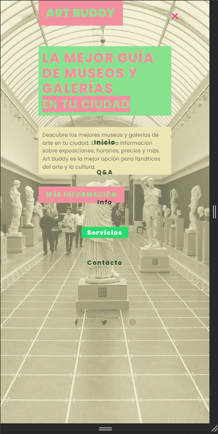

# Landing Page de Guía de Museos

En esta practica desarrollé la landing page para un proyecto que tengo en mente: Una guía de museos y galerías de arte en la ciudad de guadalajara. La idea es que la página sea un punto de encuentro para los amantes del arte y la cultura, donde puedan encontrar información sobre los museos y galerías disponibles en la ciudad para mejorar su experiencia al visitarlos y descubrir nuevos lugares y artistas.

## Capturas de pantalla

Así se ve la página en una computadora de escritorio:

Así se ve la página en un dispositivo móvil:

 

Como podemos ver los elementos son responsive y para dispositivos moviles se añade un menu de navegación que se despliega al hacer click en el icono de hamburguesa.