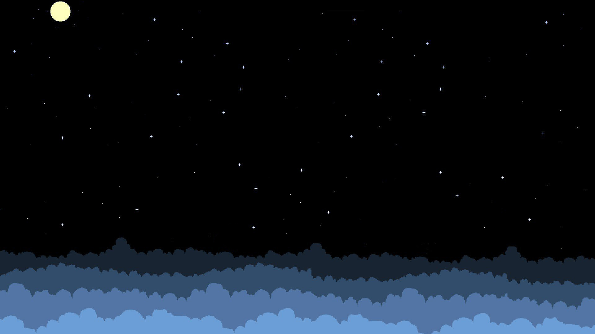
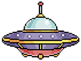
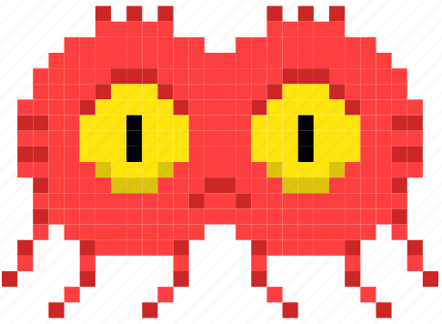

# Juego Programado con Phaser usando JavaScript

Esta práctica fue realizada con el objetivo de familiarizarse con el uso de JavaScript a través de la programación de un videojuego con el framework Phaser. El reto fue hacer un videojuego cuyo metodo de entrada fuese el cursor del mouse.

## Descripción

Mi juego consiste en un juego de disparos donde somos una nave extraterrrestre que debe destruir a los enemigos que se encuentran en el espacio. El juego tiene un sistema de puntaje en el que cada enemigo eliminado suma 10 puntos, al ser tocados por un enemigo  se termina la partida y debemos iniciar una nueva, por lo que el reto es obtener la mayor cantidad de puntos posibles.

**Estas son las vistas del juego:**
- En esta vista se puede observar la nave del jugador y los enemigos 

- Aquí podemos ver a la nave disparando

- Podemos pausa el juego en cualquier momento

- Al perder se muestra el puntaje obtenido y la opción de reiniciar el juego


Este vendría siendo basicamente el loop del juego, podemos ver en este gif el juego en acción:


## Programación

El juego fue programado con JavaScript usando el framework Phaser, el cual nos permite crear juegos de manera sencilla. Debemos tener el archivo phaser.min.js en la carpeta del proyecto para poder usarlo y enlazarlo en el archivo index.html junto con el archivo .js del juego y asi poder disponer de las funciones del framework.


### index.html

Así es como está estructurado el index.html:

```html
<!DOCTYPE html>
<html>
<head>
    <title>Space Bullet Hell</title>
    <style> 
        body { margin: 0; }
    </style>
</head>
<body>
    <script src="js/phaser.min.js"></script>
    <script src="js/gameScript.js"></script>
</body>
</html>
```
Como podemos ver sólo tenemos el título del juego y los enlaces a los archivos necesarios.

### gameScript.js

En este archivo es donde se encuentra la programación del juego, en el cual se definen las variables, se cargan los recursos, se crean los objetos y se definen las funciones que se van a usar. El código la verdad está muy extenso y no lo pondré aquí, pero explicaré las funciones más importantes de forma resumida:

#### Configuración Inicial y Variables Globales
- **Variables Globales**: Se definen variables como la velocidad del enemigo, la velocidad del jugador, la música de fondo, y otras relacionadas con el estado del juego.
- **Configuración de Phaser**: Se establece la configuración básica del juego, incluyendo dimensiones, físicas, y las funciones principales (`preload`, `create`, `update`).

#### Funciones del Juego
1. **preload()**: Carga los recursos (imágenes, audio) que se usarán en el juego.
2. **create()**: Configura el juego inicialmente. Esto incluye:
   - Crear y posicionar elementos visuales como el fondo, jugador, enemigos, etc.
   - Configurar la música de fondo.
   - Inicializar los grupos de balas y enemigos.
   - Configurar el texto de puntuación y de pausa.
   - Agregar detección de colisiones y eventos para el juego.
3. **spawnEnemies()**: Función para generar enemigos en posiciones aleatorias.

#### Clase Bullet
- Define una clase `Bullet` para las balas, incluyendo su comportamiento cuando se disparan y su ciclo de vida.

#### Funciones de Actualización y Eventos
1. **update()**: Función que actualiza el estado del juego en cada fotograma. Gestiona el movimiento del jugador y enemigos, y la acción de disparar.
2. **hitEnemy()**: Define qué sucede cuando una bala golpea a un enemigo, incluyendo actualizar la puntuación y generar nuevos enemigos.
3. **endGame()**: Se llama cuando el jugador colisiona con un enemigo, finalizando el juego.
4. **restartGame()**: Reinicia el juego.

#### Inicio del Juego
- Finalmente, crea una nueva instancia de Phaser.Game con la configuración definida, iniciando el juego.

### Assets

También es importante mencionar que se debe incluir una carpeta con los assets que se usarán en el juego, en este caso son imágenes y audio. Los assets que usé fueron los siguientes:
**Fondo del juego:**



**Nave del jugador:**



**Enemigo:**



**Bala:**


Asimismo utilice un archivo de audio para la música de fondo del juego.

## Conclusión

Este proyecto me pareció muy, me permitió familiarizarme con javascript y la verdad es que me gustó mucho el resultado y fue muy entretenido hacerlo.
