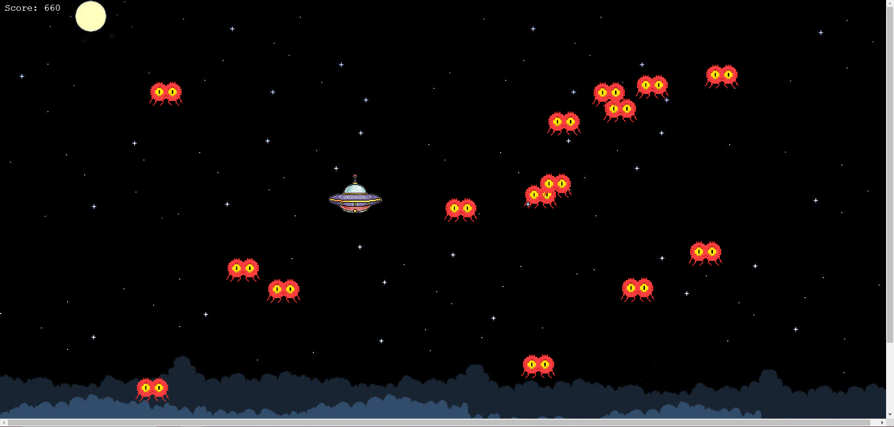
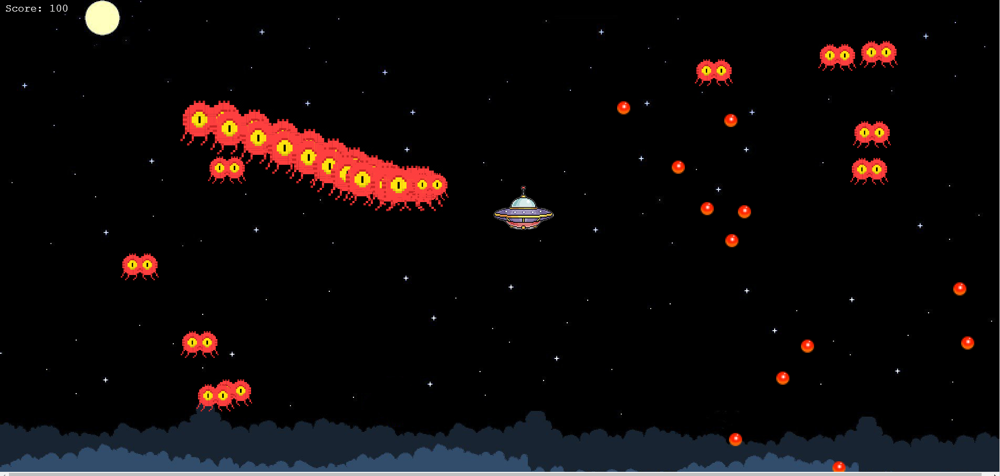
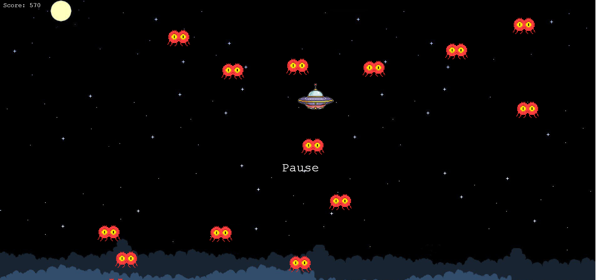
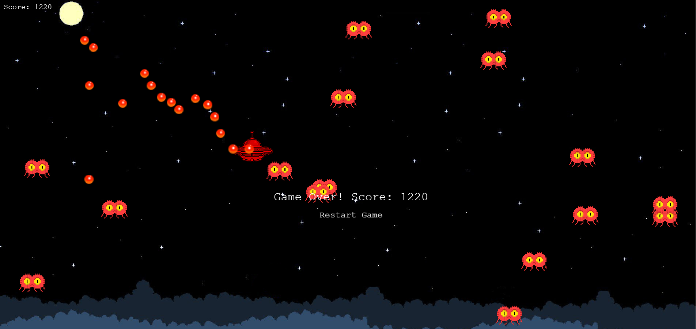
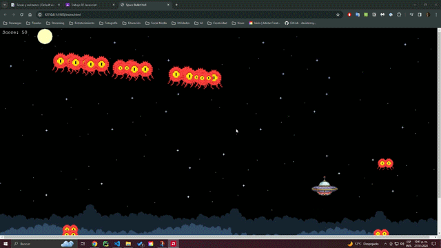

# Juego Programado con Phaser usando JavaScript

Esta práctica fue realizada con el objetivo de familiarizarse con el uso de JavaScript a través de la programación de un videojuego con el framework Phaser. El reto fue hacer un videojuego cuyo metodo de entrada fuese el cursor del mouse.

## Descripción

Mi juego consiste en un juego de disparos donde somos una nave extraterrrestre que debe destruir a los enemigos que se encuentran en el espacio. El juego tiene un sistema de puntaje en el que cada enemigo eliminado suma 10 puntos, al ser tocados por un enemigo  se termina la partida y debemos iniciar una nueva, por lo que el reto es obtener la mayor cantidad de puntos posibles.

**Estas son las vistas del juego:**
- En esta vista se puede observar la nave del jugador y los enemigos 

- Aquí podemos ver a la nave disparando

- Podemos pausa el juego en cualquier momento

- Al perder se muestra el puntaje obtenido y la opción de reiniciar el juego

Este vendría siendo basicamente el loop del juego, podemos ver en este gif el juego en acción:

