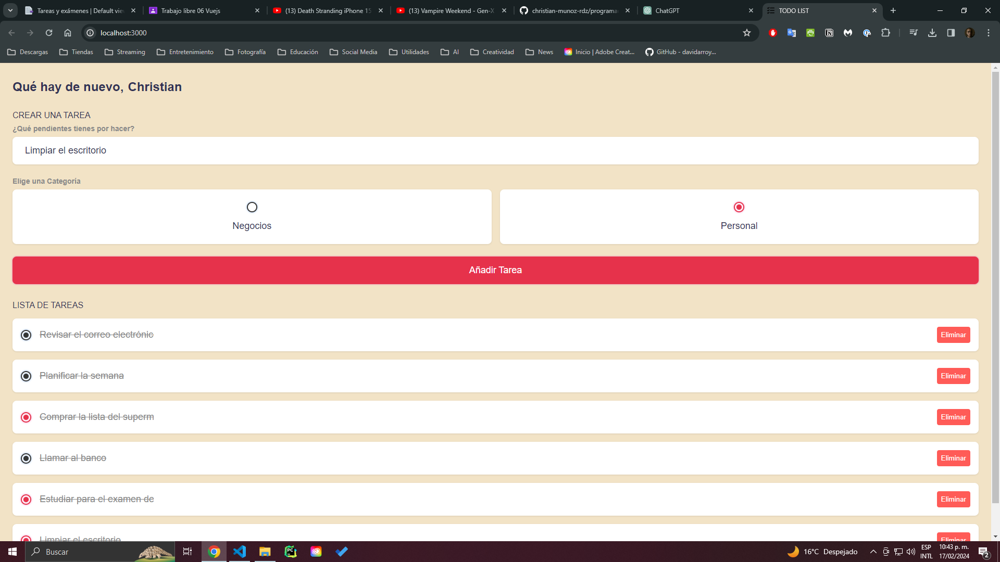

# Reporte 

Esta es una aplicación Vue que permite a los usuarios crear, visualizar, y eliminar tareas (`todos`). Utiliza varias características importantes de Vue, como `ref`, `computed`, `watch`, y el ciclo de vida `onMounted`. La aplicación también persiste los datos en el almacenamiento local (`localStorage`) para mantener el estado a través de las sesiones.

### Estructura y Funcionalidades

#### Datos Reactivos

- **`todos`**: Un arreglo reactivo que almacena las tareas.
- **`name`**: Una cadena reactiva para almacenar el nombre del usuario.
- **`input_content`**: Controla el contenido de la nueva tarea a añadir.
- **`input_category`**: Controla la categoría de la nueva tarea (por ejemplo, negocios o personal).

#### Computed Properties

- **`todos_asc`**: Propiedad calculada que retorna las tareas ordenadas de forma ascendente por la fecha de creación.

#### Observadores

- **`watch(name, ...)`**: Observa cambios en `name` y los persiste en `localStorage`.
- **`watch(todos, ..., { deep: true })`**: Observa cambios profundos en `todos` y los persiste en `localStorage`.

#### Métodos

- **`addTodo`**: Añade una nueva tarea al arreglo `todos` si el contenido y la categoría están definidos.
- **`removeTodo`**: Elimina una tarea específica del arreglo `todos`.

#### Ciclo de Vida

- **`onMounted`**: Al montar el componente, carga el nombre y las tareas desde `localStorage`.

### Template

El template divide la interfaz en tres secciones principales:

1. **Greeting**: Muestra un saludo que incluye un campo de entrada para el nombre del usuario.
2. **Create Todo**: Formulario para crear una nueva tarea con campos para el contenido y la selección de categoría.
3. **Todo List**: Lista las tareas existentes permitiendo marcarlas como completadas y eliminarlas.

Cada tarea en la lista permite la edición de su contenido y la actualización de su estado de completado. Las categorías de las tareas se indican visualmente con colores distintivos.

### Persistencia de Datos

La aplicación utiliza `localStorage` para persistir dos piezas clave de información entre las sesiones:

- El nombre del usuario.
- El arreglo de tareas, incluyendo contenido, categoría, y estado.

Esta funcionalidad asegura que los usuarios no pierdan sus datos al recargar la página o cerrar el navegador.

---
# Capturas de Pantalla

Página de inicio

Tareas agregadas

Tareas marcadas como completadas

Eliminación de tareas

Página responsiva